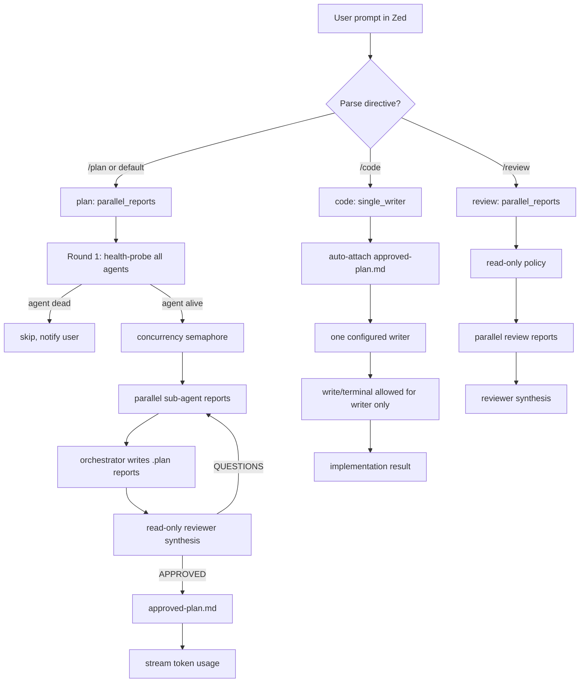
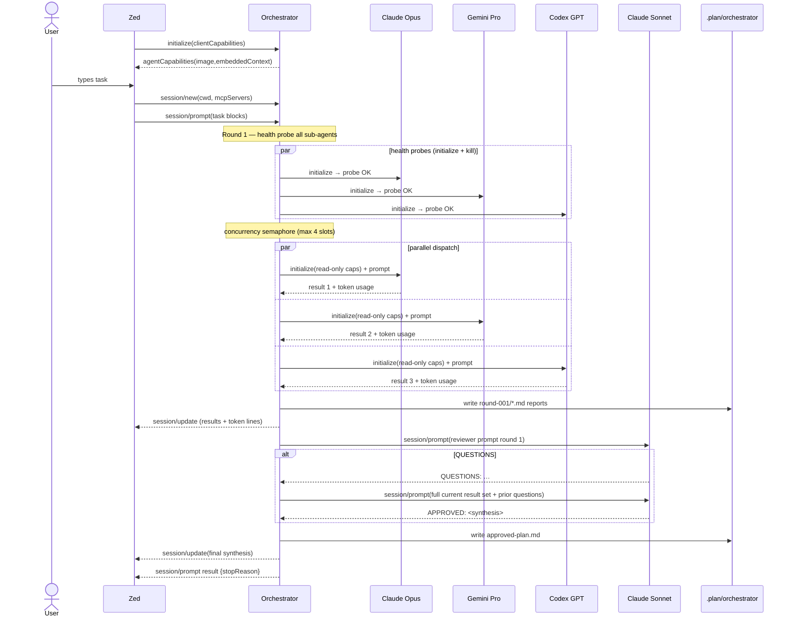
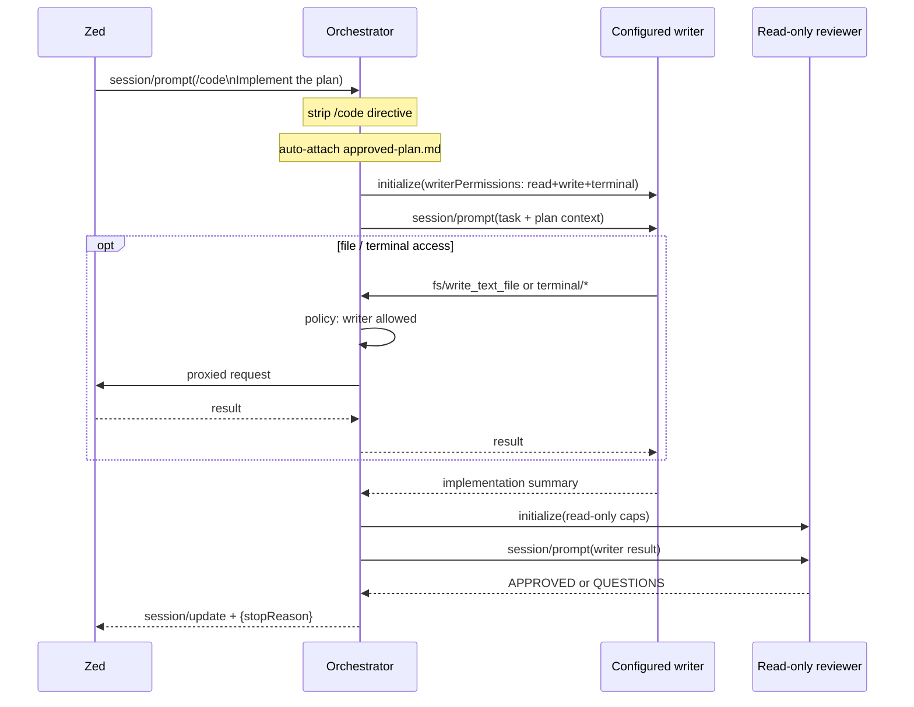
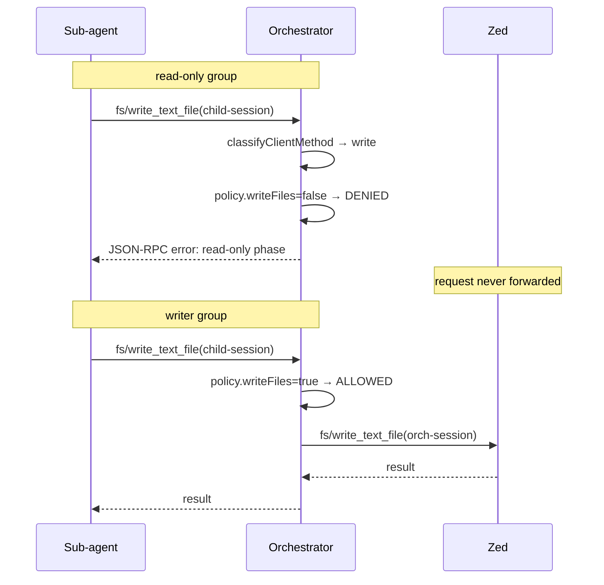

# zed-orchestrator

ACP planning-first orchestrator server for Zed IDE.  
Runs named groups of sub-agents (different models/tools) on the same task, persists their reports
under `.plan/orchestrator`, then passes the results to that group's reviewer agent. If the
reviewer has open questions it sends them back to the same group. Repeats until `APPROVED` or
`MAX_TURNS` is reached.

This is useful when you want several independent model perspectives before changing a codebase:
architecture plans, migration strategies, risk analysis, API designs, debugging hypotheses,
release plans, or implementation reviews.

> **Not a packaged Zed extension.** This is a custom external ACP agent server launched from
> `agent_servers` in Zed settings. Zed supports external ACP agents natively; packaged
> `extension.toml` agent servers may be deprecated from Zed v0.221+ in favour of the
> [ACP Registry](https://agentclientprotocol.com/get-started/registry). This orchestrator
> takes the external-server path deliberately: it is a Node process, not a WebAssembly
> extension, and it has no plans to move to the registry.

## What It Is Good For

| Use case | Fit | Why |
|---|---:|---|
| Complex planning before coding | Strong | Multiple ACP-read-only agents produce independent reports, then a reviewer synthesizes them. |
| Architecture and design reviews | Strong | Divergent model opinions are useful before committing to a design. |
| Risk analysis and migration plans | Strong | The reviewer can force another round when agents miss edge cases. |
| Implementation | Limited and explicit | Use `/code` or `@orchestrator group: code` only when one configured writer should act. |
| Parallel implementation agents | Not supported by default | Multiple writers in one workspace are intentionally avoided. |
| Final code review | Good | Use a read-only `review` group to inspect files/diffs without write/terminal access. |

## Setup

### 1. Install

```bash
git clone ... ~/src/zed-orchestrator
cd ~/src/zed-orchestrator
npm install          # installs ajv for strict config validation
```

`npm install` installs [ajv](https://ajv.js.org) so `agents.config.json` is checked against
`agents.config.schema.json` at startup. Built-in manual validation remains as a fallback for
actionable startup errors.

### 2. Configure agent groups

Edit `agents.config.json`. See the **Configuration** section below for the full field reference.

### 3. Wire into Zed

Add to `~/.config/zed/settings.json`:

```json
{
  "agent_servers": {
    "Orchestrator": {
      "type": "custom",
      "command": "node",
      "args": ["/home/YOUR_USER/src/zed-orchestrator/index.js"],
      "env": {
        "ORCHESTRATOR_CONFIG": "/home/YOUR_USER/src/zed-orchestrator/agents.config.json"
      }
    }
  }
}
```

Open Zed → Agent panel → `+` → select **Orchestrator**.

### 4. Run smoke tests

```bash
npm test                          # stub-agent assertions, no real API calls
npm run review:gate               # syntax/config/tests/package dry-run
npm run test:integration          # also runs real claude-agent-acp (needs ANTHROPIC_API_KEY)
```

Use `npm run review:gate` before asking for or responding to external review. It is the minimum
local gate for this repo: every shipped JavaScript file must parse, the default config must load
through schema/manual validation, all stub ACP assertions must pass, and the npm package contents
must be valid.

---

## How to Use

### Sending a task

Type your task directly in the Zed agent panel. The orchestrator will run the configured
`defaultGroup` (usually `plan`).

### Switching groups

Put one of these directives on the first non-empty line of the first text block in your prompt:

```
@orchestrator group: code
@orchestrator mode: review
/plan
/code
/review
```

Only that first non-empty line is parsed as a directive; pasted content later in the prompt cannot
switch groups accidentally. The directive line is stripped before the task is sent to sub-agents.
Persistent groups remain active until changed. Write-capable groups such as `code` are one-shot by
default, so each write prompt must explicitly use `/code` or `@orchestrator group: code`.

### After a plan is approved

When the `plan` group approves, the orchestrator saves `approved-plan.md` under
`.plan/orchestrator/<session>-prompt-<n>/`. A `single_writer` group can set
`attachApprovedPlanFrom` to hash-verify and automatically attach that source group's latest
approved plan to the writer and code reviewer prompt. The default `code` group sets
`"attachApprovedPlanFrom": "plan"`. If no current-session plan exists, the orchestrator may fall
back to the latest matching on-disk plan, verifies its stored hash, and warns in the Zed panel.
You can also explicitly reference a plan:

```
/code
Implement the approved plan.
```

---

## Workflows

The default `workflow` is `["plan"]` — planning only. To add automatic workflow progression after
approval, extend the list:

```json
{ "workflow": ["plan", "review"] }
```

After `plan` is approved, the next prompt in the same Zed session will use `review` when `review`
is a read-only `parallel_reports` group. Workflow groups may auto-advance even when they are
one-shot if their sub-agent and reviewer proxy policies do not allow file writes or terminal
access; they reset to `defaultGroup` after their prompt if `persist: false`. Write-capable groups,
including all `single_writer` groups, never auto-advance from approval, so keep `code` explicit
with `/code`.

### Target Design



### Default Plan Workflow



### Optional Single-Writer Code Workflow



### ACP Permission Proxy



### Artifact Layout

```text
.plan/
  orchestrator/
    orch-<timestamp>-<suffix>-prompt-0001/
      manifest.json
      input-prompt.md            ← redacted final prompt sent into orchestration
      approved-plan.md           ← auto-attached to next /code prompt
      plan/
        round-001/
          01-claude-code-opus.md
          02-gemini-cli-3.1-pro.md
          03-codex-gpt-5.5.md
          reviewer-prompt.md
          reviewer.md
        round-002/
          ...
```

---

## Configuration

Full reference for `agents.config.json`:

| Field | Type | Default | Description |
|---|---|---|---|
| `$schema` | string | — | Optional JSON Schema path for editor validation |
| `defaultGroup` | string | first group | Initial group for each new session |
| `workflow` | string[] | `[defaultGroup]` | Ordered progression after approval |
| `maxTurns` | int | 5 | Max review rounds before giving up |
| `concurrency` | int | 4 | Max sub-agents running simultaneously |
| `probeTimeoutMs` | int | 20000 | Health-probe timeout per agent on round 1 |
| `agentTimeoutMs` | int | 120000 | Per-agent wall-clock timeout |
| `maxRetries` | int | 3 | Retries on transient failures (429, 503, timeouts) |
| `retryDelayMs` | int | 5000 | Base exponential-backoff delay |
| `heartbeatMs` | int | 30000 | Ping interval while agent is working. 0 = off |
| `maxRetryAfterMs` | int | 300000 | Max sleep accepted from upstream retry-after messages |
| `retryablePatterns` | string[] | see below | Case-insensitive regex patterns matched against error messages to classify a failure as transient (worth retrying). Replaces the built-in list entirely when set. |
| `envIsolation` | bool | true | Sub-agents see only `SAFE_ENV_KEYS` + `passEnv` |
| `debug` | bool | false | Mirror every ACP frame and sub-agent stderr line to orchestrator stderr. Also via `ORCHESTRATOR_DEBUG=1`. |
| `maxLineBytes` | int | 4194304 | Max bytes for a single RPC line (OOM guard) |
| `maxOutputBytes` | int | 10485760 | Max total streamed or direct final text output per agent (OOM guard) |
| `reviewerAgentChars` | int | 40000 | Max chars of each agent result in reviewer prompt |
| `artifactDir` | string | `.plan/orchestrator` | Workspace-relative artifact root |
| `mcpServers` | array | [] | MCP servers merged with Zed-provided servers and filtered by child capabilities |
| `rateLimits` | object | {} | Token-bucket limits keyed by command or `rateLimitKey` |
| `subAgents` | array | — | Legacy default-group agent specs; use `agentGroups` for new configs |
| `reviewer` | object | — | Legacy reviewer spec, also used as a fallback for groups without `reviewer` |
| `agentGroups` | object | — | Named groups (`plan`, `code`, `review`, …) |

### Retryable patterns

`retryablePatterns` is a list of case-insensitive regex strings. Before each retry decision the
orchestrator tests the error message against every pattern. If any matches, the failure is treated
as transient and the agent is retried with exponential back-off (up to `maxRetries` attempts).
If no pattern matches **and** the error contains an HTTP status code, the task is stopped
immediately rather than continuing with partial results.

Setting this field **replaces** the built-in defaults entirely, so include everything you still
want to retry:

```json
"retryablePatterns": [
  "429", "rate.?limit", "too many requests", "overloaded",
  "503", "502", "529",
  "TIMEOUT", "ECONNRESET", "ECONNREFUSED"
]
```

To also retry on HTTP 500 (e.g. your provider proxy is flaky), append `"500"` to the list.

### Provider error visibility

Many sub-agents (e.g. Claude Code) retry transient HTTP failures internally before bubbling
anything up over ACP, so a flaky provider proxy can stall an agent for tens of seconds while the
chat shows only "still working" heartbeats. The orchestrator monitors each sub-agent's stderr in
real time and surfaces lines that look like provider HTTP errors as Zed notifications, e.g.:

```
> **AKA Opus** — provider HTTP 503: Anthropic API error: 503 Service Unavailable …
```

Detection requires both an HTTP 4xx/5xx status code and an error-context word (`error`, `http`,
`status`, `unavailable`, `timeout`, `overloaded`, …) on the same stderr line, so ordinary debug
output is ignored. Repeated notifications for the same status code are throttled to one every 3
seconds per agent. Lines are redacted and truncated before display.

### Debug logging

The above heuristics only catch error formats we already know. Different sub-agents (Claude
Code, Copilot, etc.) report failures through different channels — sometimes ACP error
responses, sometimes stderr, sometimes embedded in the assistant text — and you may need to
discover the format before you can act on it.

Set `debug: true` in your config (or `ORCHESTRATOR_DEBUG=1` in the environment) to mirror
**everything** that flows between the orchestrator and each sub-agent to the orchestrator's
stderr:

- `[debug] [Agent-Name] spawned pid=12345 command=… args=[…]`
- `[debug] [Agent-Name] → id=1 method=initialize params={…}` — every outbound ACP frame
- `[debug] [Agent-Name] ← id=1 result={…}` — every inbound ACP frame (responses, errors, notifications)
- `[debug] [Agent-Name] stderr: <every stderr line, verbatim>`
- `[debug] [Agent-Name] exited code=0 signal=null`

Frames are JSON-stringified, redacted with the same scrubber used for chat output, and
truncated at 800 characters per entry. In Zed this stream shows up under **dev: open acp
logs** as `_type: "stderr"` entries, alongside your normal orchestrator log lines. Open it
during a failing run to see exactly which channel a sub-agent uses to report an upstream
error, then either extend `retryablePatterns` or refine `PROVIDER_ERROR_CONTEXT_RE` (in
`orchestrator.js`) once you know the format.

### Rate limit fields

`rateLimits` is an object keyed by bucket name. A bucket is selected by an agent's
`rateLimitKey`; when `rateLimitKey` is absent, the agent's `command` is used instead. The key is
just a stable string. Use a provider/model slug when the quota is model-specific, such as
`kilo-minimax-m2.7`; use a command name when the quota applies to every invocation of that
command.

| Field | Type | Description |
|---|---|---|
| `requestsPerMinute` | number | Average allowed starts per minute for this bucket |
| `burstSize` | int | Optional initial/max token count for short bursts. Defaults to `requestsPerMinute` |

### MCP server fields

| Field | Type | Description |
|---|---|---|
| `type` | string | `http` for URL servers or `stdio` for child-process servers |
| `name` | string | Server name forwarded to child agents |
| `url` | string | Required HTTP MCP endpoint when `type: "http"` |
| `command` | string | Required executable when `type: "stdio"` |
| `args` | string[] | Arguments for a stdio MCP server command |
| `env` | array | Stdio env entries as `{ "name": "...", "value": "..." }`; values support env placeholders |
| `headers` | array | HTTP header entries as `{ "name": "...", "value": "..." }`; empty bearer-token headers are dropped |
| `name` / `value` | string | Entry fields inside `env` and `headers`; `name` is the env/header name and `value` is the forwarded value |

### Agent spec fields

| Field | Type | Description |
|---|---|---|
| `name` | string | Display name |
| `command` | string | Executable. String values support `{env:VAR}` / `${VAR}` expansion, plus whole-string `$VAR` |
| `args` | string[] | CLI arguments. String values support `{env:VAR}` / `${VAR}` expansion, plus whole-string `$VAR` |
| `sandboxCommand` | string | Optional wrapper executable. The real `command` and `args` are appended after `sandboxArgs`. |
| `sandboxArgs` | string[] | Arguments passed to `sandboxCommand` before the real agent command. |
| `env` | object | Extra env vars set for this agent. Values support `{env:VAR}` / `${VAR}` expansion, plus whole-string `$VAR` |
| `passEnv` | string[] | Env keys forwarded from orchestrator env when `envIsolation: true` |
| `credHome` | string | Workspace-relative, absolute, or `~/...` path used as `HOME` for this agent. Gives each agent its own credential directory, preventing one provider's auth files from being read by another agent. |
| `allowRealHome` | bool | Explicitly forward the real `HOME`/XDG dirs when `envIsolation: true` and `credHome` is unset |
| `rateLimitKey` | string | Select the matching `rateLimits` bucket. Use the same key for agents that share a provider/model quota. Default: `command` |
| `agentTimeoutMs` | int | Per-agent override |
| `maxRetries` | int | Per-agent override |
| `retryDelayMs` | int | Per-agent retry backoff override |
| `heartbeatMs` | int | Per-agent heartbeat interval override |
| `envIsolation` | bool | Per-agent override |

### Group spec fields

| Field | Type | Description |
|---|---|---|
| `description` | string | Human-readable group purpose shown in config and useful for operators |
| `strategy` | string | `"parallel_reports"` or `"single_writer"` |
| `persist` | bool | When `false`, reset to `defaultGroup` after the prompt. Defaults to `false` for `single_writer`, `true` otherwise. |
| `permissions` | string \| object | Default ACP policy for all agents in this group |
| `writerPermissions` | string \| object | Policy for the designated writer |
| `reviewerPermissions` | string \| object | Policy for the reviewer. Reviewers must remain read-only. |
| `writer` | string | Agent name used as the sole writer in `single_writer` mode |
| `attachApprovedPlanFrom` | string | Optional source group whose `approved-plan.md` is auto-attached before this group runs |
| `concurrency` | int | Group-level override for the global `concurrency` |
| `maxTurns` | int | Group-level override |
| `artifactDir` | string | Group-level override |
| `subAgents` | array | Agent specs |
| `reviewer` | object | Reviewer agent spec |

### Permission object fields

| Field | Type | Description |
|---|---|---|
| `readFiles` | bool | Allow proxied ACP file-read requests |
| `writeFiles` | bool | Allow proxied ACP file-write requests |
| `terminal` | bool | Allow proxied ACP terminal requests |
| `mcp` | bool | Forward MCP servers to agents when child capabilities allow them |
| `allowUnknownClientRequests` | bool | Forward unknown ACP client methods. Keep `false` in read-only groups |

### Permission policies

```json
"permissions": "read_only"       // readFiles=true, writeFiles=false, terminal=false, mcp=false
"permissions": "writer_only"     // readFiles=true, writeFiles=true,  terminal=true,  mcp=true
"permissions": { "readFiles": true, "writeFiles": false, "terminal": false, "mcp": false }
"permissions": { "readFiles": true, "writeFiles": false, "terminal": false, "mcp": true }   // opt-in MCP
```

`parallel_reports` groups are always read-only. Startup rejects write/terminal permissions,
`writer`, or `writerPermissions` on those groups; use `single_writer` for code-changing phases.
`single_writer` reviewers default to read-only and startup rejects write-capable reviewer policy.

Here, read-only is an ACP proxy policy: the orchestrator masks write/terminal capabilities and
denies proxied write and terminal requests according to policy. Clearly read-only permission
requests such as file reads or search/fetch-style built-ins are still proxied; unknown client
methods remain blocked by default.
It is not an OS filesystem sandbox for the child CLI process. Use `sandboxCommand`/`sandboxArgs`,
or a provider-native read-only mode you have verified, when you need a stronger non-mutation
guarantee.

**MCP is opt-in for read-only phases.** The `read_only` shortcut sets `mcp: false`. MCP servers
expose tool surfaces whose mutability is opaque to the orchestrator (a server may host write,
shell, migration, or deployment tools); forwarding them to parallel planners means those agents
are no longer just producing independent reports. Set `mcp: true` only when every server in the
forwarded list is known to be read-only — for example a separate `plan-with-readonly-mcp` group
that wires a curated set of inspection servers.

`allowUnknownClientRequests` (default `false`) is a compatibility escape hatch for unknown future
ACP client methods; in read-only phases the orchestrator denies any client request that is not
explicitly classified as fs/terminal/permission, and permission requests are only proxied when
they are clearly read-only.

---

## Best Practices

### Package pinning

The checked-in config uses pinned `@version` suffixes:

```json
"args": ["--yes", "--package", "@agentclientprotocol/claude-agent-acp@0.32.0", "claude-agent-acp"]
```

Update the version when you upgrade. To skip the per-spawn `npx` overhead, install globally:

```bash
npm run install-acp-tools
```

### Per-agent credential isolation (`credHome`)

Add a `credHome` to each agent that points to a dedicated directory:

```json
{
  "name": "Claude Code (Opus 4.6)",
  "credHome": "~/.local/share/zed-orchestrator/claude-opus",
  "passEnv": ["ANTHROPIC_API_KEY"]
}
```

The orchestrator creates the directory and sets the agent's `HOME`, `XDG_CONFIG_HOME`,
`XDG_DATA_HOME`, `XDG_CACHE_HOME`, `XDG_STATE_HOME`, and provider-specific homes such as
`CODEX_HOME`, `GEMINI_CLI_HOME`, `CLAUDE_CONFIG_DIR`, `OPENCODE_CONFIG_DIR`,
and `KILO_CONFIG_DIR` to paths inside it. For every Kilo Code agent, the orchestrator also
sets a per-spawn `KILO_DB` so parallel Kilo ACP processes do not contend for the same global
SQLite database at startup. With `credHome`, that database is placed under `credHome`; without
`credHome`, it is placed under the system temp directory.
When `credHome` is set, `env` and `passEnv` cannot override those home keys.

**Important:** After setting `credHome`, you must authenticate each agent inside its isolated
home at least once. Run each CLI manually with `HOME=~/.local/share/zed-orchestrator/<agent> <cli> auth login`
or equivalent. The `passEnv` approach (API key env var) does not require this — the key
is passed directly.

When `envIsolation` is enabled, the real `HOME` and XDG home directories are no longer forwarded
unless `allowRealHome: true` is set on that agent. Prefer `credHome` or explicit API-key `passEnv`
entries over `allowRealHome`.

### Env isolation

String values in `agents.config.json` support `{env:VAR}` and `${VAR}` placeholders. Values that
are exactly `$VAR` are also expanded; bare `$VAR` is intentionally not expanded inside larger
strings so embedded JSON keys such as `"$schema"` are preserved. Before the config is expanded,
the orchestrator loads a `.env` file from the same directory as the active config file
(`ORCHESTRATOR_CONFIG`, or the default `agents.config.json`). Existing shell environment variables
take precedence over `.env` values.

```dotenv
PLAN_MODEL=gemini-3.1-pro-preview
OPENROUTER_API_KEY=...
```

```json
{
  "args": ["--model", "{env:PLAN_MODEL}"],
  "env": {
    "OPENCODE_CONFIG_CONTENT": "{\"provider\":{\"openrouter\":{\"options\":{\"apiKey\":\"{env:OPENROUTER_API_KEY}\"}}}}"
  }
}
```

Keep `envIsolation: true` (the default). Use `passEnv` to forward only the exact env key each
agent needs:

```json
{
  "name": "Gemini CLI",
  "passEnv": ["GEMINI_API_KEY", "GOOGLE_CLOUD_PROJECT"]
}
```

When `envIsolation: true`, the orchestrator forwards a deliberately small base set:

- `PATH`, `USER`, `LOGNAME`, `SHELL`
- locale (`LANG`, `LANGUAGE`, `LC_*`), `TZ`, `TERM`
- temp dirs (`TMPDIR`, `TMP`, `TEMP`, `XDG_RUNTIME_DIR`)
- proxy variables (`HTTP_PROXY`, `HTTPS_PROXY`, `NO_PROXY` and lower-case variants — note that
  proxy URLs may include credentials)
- Windows essentials needed to spawn programs (`SYSTEMROOT`, `COMSPEC`, `PATHEXT`, `PROGRAMDATA`)

`NODE_PATH` is **not** forwarded (it can override module resolution); add it via `passEnv` only if
you knowingly need it. Real `HOME`/XDG dirs **and** Windows home equivalents
(`USERPROFILE`/`APPDATA`/`LOCALAPPDATA`) are forwarded only when `allowRealHome: true` and
`credHome` is unset; prefer `credHome` for credential isolation.

### Concurrency tuning

The default concurrency is 4. Lower it if you hit rate limits from a single provider:

```json
{
  "agentGroups": {
    "plan": {
      "concurrency": 2
    }
  }
}
```

### Health probes

On round 1, the orchestrator runs an `initialize`-only probe for each sub-agent (not the reviewer),
using the same concurrency cap as the real fan-out. Agents that fail within `probeTimeoutMs`
(default 20 s) are skipped with a warning. The longer default avoids false skips during first-run
`npx --yes --package ...` installs. For faster steady-state startup, run `npm run install-acp-tools`
and point agent `command` fields at the installed binaries. Set `probeTimeoutMs: 0` to disable.

### Token telemetry

When a sub-agent or reviewer streams `session/update` events with a `usage` field, the
orchestrator surfaces a concise token line in the Zed panel:

```
> tokens: 1840 in / 342 out
```

This helps you track per-agent costs across rounds.

### Schema validation

Run `npm install` or `npm ci` before tests and normal use. The orchestrator validates
`agents.config.json` against `agents.config.schema.json` at startup and exits with clear error
messages on misconfiguration. Built-in manual validation still catches critical problems if the
schema package is unavailable.

### Project-specific config

Point `ORCHESTRATOR_CONFIG` to a project-local file:

```json
{
  "agent_servers": {
    "Orchestrator": {
      "env": {
        "ORCHESTRATOR_CONFIG": "/home/YOU/src/my-project/.orchestrator.json"
      }
    }
  }
}
```

---

## Security

| Defence | Behaviour |
|---|---|
| `envIsolation: true` | Sub-agents inherit only safe base keys; secrets must be opt-in via `passEnv` |
| `credHome` per agent | Each agent gets its own `HOME`; no cross-provider credential file reads |
| Permission masking | `maskClientCapabilities()` removes write/terminal from capability object before `initialize` |
| Request guard | `assertAllowedClientRequest()` blocks write/terminal and read-only permission-escalation requests at proxy layer — Zed never sees them |
| Side-effect retries | A child is not retried after a proxied write, terminal, or permission request |
| Stop reason handling | Child `stopReason` values other than `end_turn` are treated as degraded/failure results |
| `session/cancel` as notification | `maybeReply` correctly suppresses a response when `id` is absent |
| Secret redaction | `redact()` strips common API keys, bearer tokens, JWTs, GitHub/AWS/Slack tokens, PEM private keys, and credentialed URLs from streamed output and artifacts |
| Output bounds | `maxLineBytes` + `maxOutputBytes` cap stdout lines, stderr, streamed text, and direct final text from misbehaving agents |
| Symlink-safe artifacts | Artifact writes verify canonical paths stay inside the workspace |
| Reproducible prompt artifacts | Redacted input and reviewer prompts are stored with each run for external review replay |
| Approved-plan tamper-evident hash | `approved-plan.md` includes a `sha256` consistency check; code-mode auto-attach verifies it before using the plan. This is a local consistency check, not a cryptographic signature — any local process with write access can edit the plan and recompute the hash. |
| Retry-after cap | `maxRetryAfterMs` prevents `retry after 999999s` parking the loop |
| Prompt injection reduced | Agent reports are marked as untrusted evidence, and `APPROVED:` / `QUESTIONS:` in agent output is rewritten before reaching reviewer |
| Pinned packages | All CLIs use `@version` pins; set `command` to a bare binary for additional reproducibility |

### Remaining risks

- **`credHome` requires initial auth per agent.** If you rely on credential files (not env API
  keys), log in once inside each `credHome`. The orchestrator does not copy existing credentials
  into the new home.
- **ACP read-only is not a filesystem sandbox.** Read-only means "read-only through the ACP client
  API exposed by this orchestrator." Each child CLI still runs as the current OS user unless you
  separately sandbox it, and native MCP/config loaded by that CLI is outside the orchestrator's
  control.
- **Sandbox wrappers are optional and platform-specific.** Use `sandboxCommand`/`sandboxArgs` for
  agents that should run under a wrapper such as `bwrap`, `firejail`, `sandbox-exec`, a container
  command, or your own launcher:

```json
{
  "name": "Sandboxed planner",
  "sandboxCommand": "bwrap",
  "sandboxArgs": ["--ro-bind", ".", ".", "--dir", "/tmp", "--unshare-net"],
  "command": "claude-agent-acp",
  "args": []
}
```

- **Reviewer prompt injection is reduced, not eliminated.** Reports are delimited as untrusted
  evidence, but a compromised agent can still write persuasive text. Feed untrusted external
  content through agents with caution.

---

## ACP compatibility

| Item | Value |
|---|---|
| Protocol version | ACP v1 (`protocolVersion: 1`) |
| Minimum Zed version | Zed 0.160+ (first release to ship ACP v1 support) |
| `session/prompt` response | `{ stopReason }` only — final text streamed via `session/update` |
| `session/cancel` | Treated as notification; `maybeReply` suppresses response when `id` absent |
| `agentCapabilities` | Advertises `image`, `embeddedContext`, `sessionCapabilities.close` |
| Prompt blocks | `text` and `resource_link` are always forwarded; `image` and embedded `resource` require advertised child capabilities |
| MCP servers | Merged from `session/new mcpServers` + `agents.config.json mcpServers`, then filtered by each child agent's MCP capabilities |
| Child protocol mismatch | Logged to stderr and continues (non-fatal) |

---

## Files

```
zed-orchestrator/
├── index.js              ← ACP server (thin framing layer)
├── orchestrator.js       ← orchestration loop, health probes, telemetry, plan handoff
├── acp-client.js         ← ACP stdio client (spawn, init, probe, prompt)
├── policy.js             ← capability masking and request policy enforcement
├── artifact-store.js     ← .plan/orchestrator artifact writer
├── concurrency.js        ← FIFO semaphore for parallel-fanout throttling
├── redact.js             ← secret scrubbing for streamed error messages
├── rate-limiter.js       ← token bucket rate limiter
├── config.js             ← config loader + ajv/manual validation
├── agents.config.json    ← agent definitions (edit this)
├── agents.config.schema.json
├── zed-settings.example.json
├── package.json
├── scripts/
│   └── install-acp-tools.js
└── test/
    └── smoke.js          ← stub-agent assertions + integration tests (RUN_INTEGRATION_TESTS=1)
```

---

## Tuning

| What to change | Where |
|---|---|
| Add/remove sub-agents | `agents.config.json` → `agentGroups.<name>.subAgents` |
| Change reviewer model | `agents.config.json` → `agentGroups.<name>.reviewer` |
| Change group order | `agents.config.json` → `workflow` |
| Change first group for new sessions | `agents.config.json` → `defaultGroup` |
| Force a group for one prompt | Put `/code`, `/review`, or `@orchestrator group: <name>` on the first non-empty prompt line |
| Change group strategy | `agents.config.json` → `agentGroups.<name>.strategy` |
| Limit parallel launches | `agents.config.json` → `concurrency` (global) or `agentGroups.<name>.concurrency` |
| Health-probe timeout | `agents.config.json` → `probeTimeoutMs` |
| Isolate agent credentials | `agents.config.json` → per-agent `credHome` |
| Forward specific env keys | `agents.config.json` → per-agent `passEnv` |
| Pin package versions | `agents.config.json` → `@<name>@<version>` in `args` |
| Change single writer | `agents.config.json` → `agentGroups.code.writer` |
| Change artifact location | `agents.config.json` → `artifactDir` |
| Increase max rounds | `agents.config.json` → `maxTurns` |
| Heartbeat interval | `agents.config.json` → `heartbeatMs` (0 = off) |
| Use a project-specific config | `ORCHESTRATOR_CONFIG=/path/to/project.json` in Zed settings env |

---

## How a session looks in Zed

```
---
## Round 1 / 5
Group: plan
Running 3 sub-agent(s) in parallel (concurrency cap: 4)...

### Claude Code (Opus 4.6, max effort)
[claude result...]
> tokens: 2840 in / 412 out

### Gemini CLI (3.1 Pro Preview)
[gemini result...]

### Codex (GPT-5.5, ...)
[codex result...]

### Claude Agent ACP (Sonnet 4.6)
QUESTIONS:
1. Does the implementation handle authentication tokens correctly?
2. Is error handling consistent across all API routes?
> reviewer tokens: 8200 in / 180 out

---
## Round 2 / 5
Group: plan
Running 3 sub-agent(s) in parallel (concurrency cap: 4)...
...
### Claude Agent ACP (Sonnet 4.6)
APPROVED: Use the Opus architecture notes, Gemini risk analysis, and Codex implementation details...
> reviewer tokens: 7100 in / 95 out
```

---

## Shared MCP tools via lazy-mcp (optional)

Sub-agents receive MCP servers from two sources merged without duplicates:
1. `mcpServers` in `agents.config.json` (your static tools)
2. `mcpServers` from Zed's `session/new` (Zed-provided context servers)

Configured MCP servers are normalized before forwarding. `stdio` entries are sent with
`type`, `name`, `command`, `args: []`, and `env: []`; `http` entries are sent with `type`,
`name`, `url`, and `headers: []`. Header and stdio env values support `{env:ENV_VAR}` and
`${ENV_VAR}` expansion at startup; empty `Bearer ${MISSING_TOKEN}` headers are dropped.

The merged list is filtered per child after `initialize`: `stdio` servers are forwarded, while
`http`/`sse` servers are only forwarded to agents that advertise those MCP capabilities. Dropped
servers are reported in the Zed panel.

For parallel sub-agents, [lazy-mcp](https://gitlab.com/gitlab-org/ai/lazy-mcp) is the
recommended MCP proxy — it is stateless over HTTP so concurrent requests from parallel agents
don't interfere, and it reduces initial token usage by ~90% via lazy tool loading.

```json
{
  "mcpServers": [
    {
      "type": "http",
      "name": "lazy-mcp",
      "url": "http://127.0.0.1:8080/mcp",
      "headers": [{ "name": "Authorization", "value": "Bearer ${LAZY_MCP_TOKEN}" }]
    }
  ]
}
```

`${LAZY_MCP_TOKEN}` is expanded from `process.env` or the config-adjacent `.env` at startup.
Stdio MCP servers can pass env in ACP name/value-array form:

```json
{
  "type": "stdio",
  "name": "local-docs",
  "command": "node",
  "args": ["server.js"],
  "env": [{ "name": "DOCS_TOKEN", "value": "${DOCS_TOKEN}" }]
}
```

---

## Agent CLI reference

ACP sub-agent command examples with model selection. Some ACP bridges expose model choice as a
startup flag; others use environment/config settings or ACP `session/set_model` instead.
When using `npx --package`, keep the binary name as an explicit argument after the package name
so ACP flags are passed to that executable.

| Agent | Command |
|---|---|
| GitHub Copilot | `COPILOT_MODEL=auto npx --yes --package @github/copilot-language-server@latest copilot-language-server --acp` |
| Claude Code | `ANTHROPIC_MODEL=claude-sonnet-4-6 npx @zed-industries/claude-code-acp@latest` |
| Gemini CLI | `npx @google/gemini-cli@latest --model auto --experimental-acp` |
| Qwen Code | `npx @qwen-code/qwen-code@latest --model qwen3.6-plus --acp` |
| Auggie CLI | `npx @augmentcode/auggie@latest --model <model-id> --acp` |
| Qoder CLI | `npx @qoder-ai/qodercli@latest --model auto --acp` |
| Kilo Code | `npx --yes --package @kilocode/cli@latest kilo --model kilo/minimax/minimax-m2.7 acp` |
| Codex CLI | `npx @zed-industries/codex-acp@latest -c model="o3"` |
| OpenCode | `npx opencode-ai@latest --model <provider/model> acp` |
| OpenClaw | `openclaw acp` (model selection is not exposed as an ACP startup option) |
| Kiro CLI | `kiro-cli settings chat.defaultModel claude-opus-4.7 && kiro-cli acp` |
| Hermes Agent | `hermes model && hermes acp` |

| Agent | `command` / `args` / `env` | Source |
|---|---|---|
| GitHub Copilot | `npx --yes --package @github/copilot-language-server@latest copilot-language-server --acp`; `COPILOT_MODEL` | [Copilot Language Server](https://www.npmjs.com/package/@github/copilot-language-server) |
| Claude Agent ACP (Opus/Sonnet 4.6) | `npx --yes --package @agentclientprotocol/claude-agent-acp@0.32.0 claude-agent-acp`; `ANTHROPIC_MODEL` and `CLAUDE_CODE_EFFORT_LEVEL` | [claude-agent-acp](https://github.com/agentclientprotocol/claude-agent-acp) |
| Gemini CLI (3.1 Pro Preview) | `npx --yes --package @google/gemini-cli@0.41.1 gemini --acp --model gemini-3.1-pro-preview` | [Gemini CLI ACP](https://github.com/google-gemini/gemini-cli/blob/main/docs/cli/acp-mode.md) |
| Codex ACP (GPT-5.5) | `npx --yes --package @zed-industries/codex-acp@0.5.0 codex-acp`; model from `~/.codex/config.toml` | [Zed external agents](https://zed.dev/docs/ai/external-agents) |
| Kilo Code (MiniMax M2.7) | `npx --yes --package @kilocode/cli@1.0.0 kilo --model kilo/minimax/minimax-m2.7 acp` | [Kilo CLI](https://kilo.ai/docs/code-with-ai/platforms/cli) |
| OpenCode (Qwen3.6 Plus via OpenRouter) | `npx --yes --package opencode-ai@0.6.0 opencode acp`; `OPENCODE_CONFIG_CONTENT` sets model | [OpenCode ACP](https://opencode.ai/docs/acp/) |

Verified bare-binary ACP commands (use after `npm run install-acp-tools`):

| CLI | `command` | `args` |
|---|---|---|
| claude-agent-acp | `claude-agent-acp` | `[]` |
| Gemini CLI | `gemini` | `["--acp"]` |
| Codex ACP | `codex-acp` | `[]` |
| Kilo Code | `kilo` | `["acp"]` |
| OpenCode | `opencode` | `["acp"]` |
| Qwen Code | `qwen` | `["--acp"]` |
| Kimi Code | `kimi` | `["acp"]` |

### OpenCode provider model options

Model-level `options` are passed via `OPENCODE_CONFIG_CONTENT` (deep-merged with existing config).
The full list is defined in [`packages/opencode/src/provider/provider.ts`](https://github.com/sst/opencode/blob/main/packages/opencode/src/provider/provider.ts).

#### Anthropic (Claude)

```json
{ "thinking": { "type": "enabled", "budgetTokens": 16000 } }
```

Newer models (`claude-opus-4.7`+) support adaptive effort:

```json
{ "thinking": { "type": "adaptive" }, "effort": "high" }
```

Variants: `low`, `medium`, `high`, `xhigh`, `max` (model-dependent).

#### OpenAI (GPT)

```json
{ "reasoningEffort": "medium", "reasoningSummary": "auto", "store": false }
```

Variants: `none`, `low`, `medium`, `high`, `xhigh` (model- and date-dependent).

#### Google (Gemini)

Gemini 2.5:
```json
{ "thinkingConfig": { "includeThoughts": true, "thinkingBudget": 16000 } }
```

Gemini 3+:
```json
{ "thinkingConfig": { "includeThoughts": true, "thinkingLevel": "high" } }
```

Variants: `minimal`, `low`, `medium`, `high`, `max`.

#### Kimi / Moonshot (`kimi-k2`)

Via Anthropic SDK:
```json
{ "thinking": { "type": "enabled", "budgetTokens": 16000 } }
```

Via OpenAI-compatible / baseten:
```json
{ "chat_template_args": { "enable_thinking": true } }
```

#### Qwen (Alibaba)

```json
{ "enable_thinking": true }
```

#### Minimax / GLM (zhipuai / zai)

```json
{ "thinking": { "type": "enabled", "clear_thinking": false } }
```

#### Other providers

| Provider | Option shape |
|---|---|
| Amazon Bedrock (Anthropic) | `{ "reasoningConfig": { "type": "adaptive", "maxReasoningEffort": "high" } }` |
| Amazon Bedrock (Nova) | `{ "reasoningConfig": { "type": "enabled", "maxReasoningEffort": "medium" } }` |
| Azure | `{ "reasoningEffort": "medium", "reasoningSummary": "auto", "store": false }` |
| xAI / Grok | `{ "reasoningEffort": "low" }` or `{ "reasoningEffort": "high" }` |
| Mistral | `{ "reasoningEffort": "high" }` |
| Groq | `{ "reasoningEffort": "low" }` / `"medium"` / `"high"` |
| Cerebras | `{ "reasoningEffort": "low" }` / `"medium"` / `"high"` |
| Venice | `{ "reasoningEffort": "..." }` or `{ "veniceParameters": { "disableThinking": true } }` |
| OpenRouter | `{ "reasoning": { "effort": "high" } }` (for reasoning models) |

#### Setting options via env

```bash
export OPENCODE_CONFIG_CONTENT='{
  "provider": {
    "anthropic": {
      "models": {
        "claude-opus-4-6": {
          "options": { "thinking": { "type": "enabled", "budgetTokens": 16000 } }
        }
      }
    }
  }
}'
```

Or inline in `agents.config.json`:

```json
{
  "env": {
    "OPENCODE_CONFIG_CONTENT": "{\"provider\":{\"anthropic\":{\"models\":{\"claude-opus-4-6\":{\"options\":{\"thinking\":{\"type\":\"enabled\",\"budgetTokens\":16000}}}}}}}"
  }
}
```
